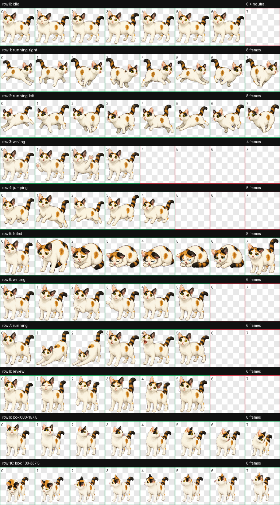
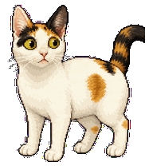

# Missy — Codex Pet v2

> **Former bullied stray. Current desktop diva. Zero shame.**

Missy was once a street cat who got pushed away from the best spots. Adoption and a safe home unlocked her loud, theatrical, mischievous confidence. She is now a custom animated calico-cat pet for the Codex desktop app, based on her white, orange, and black markings, round body, large upright ears, yellow-green eyes, and thick calico tail.



### Her most shameless move



Missy is a lovable little calico cat who keeps you company and playfully interacts with you while you work.

## Download

[Download the latest Missy installer](https://github.com/CHENGY12/missy-codex-pet/releases/latest/download/missy-codex-pet-v2.zip)

[Install Missy (v2.3.1) directly in Codex](codex://pets/install?name=Missy%20(v2.3.1)&imageUrl=https%3A%2F%2Fraw.githubusercontent.com%2FCHENGY12%2Fmissy-codex-pet%2Fmain%2Fmissy%2Fspritesheet.webp&description=Missy%20is%20a%20lovable%20little%20calico%20cat%20who%20keeps%20you%20company%20and%20playfully%20interacts%20with%20you%20while%20you%20work.&spriteVersionNumber=2)

Install from this GitHub repository with `npx`:

```sh
npx --yes github:CHENGY12/missy-codex-pet add missy
```

That command installs the latest version. You can also choose any preserved pet version explicitly:

```sh
# v2.3.1 — latest; stable idle + poop-and-peek + corrected true-profile left run
npx --yes github:CHENGY12/missy-codex-pet add missy@2.3.1

# v2.2.1 — locked idle position, natural blink, broader tail swish
npx --yes github:CHENGY12/missy-codex-pet add missy@2.2.1

# v2.2.0 — optional cute failed-state poop-and-peek animation
npx --yes github:CHENGY12/missy-codex-pet add missy@2.2.0

# v2.1.2 — previous Stretch & Meow release
npx --yes github:CHENGY12/missy-codex-pet add missy@2.1.2

# v2.1.1 — previous Stretch & Meow release
npx --yes github:CHENGY12/missy-codex-pet add missy@2.1.1

# v2.0.0 — Missy Original
npx --yes github:CHENGY12/missy-codex-pet add missy@2.0.0
```

The Original and newer editions use distinct pet IDs and can remain in Codex together. The v2.1.1 through v2.3.1 releases share the `missy` ID, so choosing one replaces the other; `--force` preserves the replaced copy as a backup.

Versioned ZIP downloads:

- [Missy v2.3.1](https://github.com/CHENGY12/missy-codex-pet/releases/download/v2.3.1/missy-codex-pet-v2.zip)
- [Missy Stretch & Meow v2.2.1](https://github.com/CHENGY12/missy-codex-pet/releases/download/v2.2.1/missy-codex-pet-v2.zip)
- [Missy Poop & Peek v2.2.0](https://github.com/CHENGY12/missy-codex-pet/releases/download/v2.2.0/missy-codex-pet-v2.zip)
- [Missy Stretch & Meow v2.1.2](https://github.com/CHENGY12/missy-codex-pet/releases/download/v2.1.2/missy-codex-pet-v2.zip)
- [Missy Stretch & Meow v2.1.1](https://github.com/CHENGY12/missy-codex-pet/releases/download/v2.1.1/missy-codex-pet-v2.zip)
- [Missy v2.0.0](https://github.com/CHENGY12/missy-codex-pet/releases/download/v2.0.0/missy-codex-pet-v2.zip)

The public `codex-pets` catalog command will be:

```sh
npx codex-pets add missy
```

The direct-install link requires a Codex version with the custom pet install flow enabled. The ZIP also includes a local macOS installer and bilingual instructions. No API key is required.

The installer refuses to overwrite a different existing `missy` folder. Pass `--force` to preserve the existing folder as a timestamped backup and install the selected version.

## Install from the ZIP

1. Download and unzip `missy-codex-pet-v2.zip`.
2. Double-click `install.command` on macOS.
3. Open Codex and go to **Settings > Pets**.
4. Select **Refresh**, choose **Missy**, and use `/pet` or **Wake Pet** if needed.

Manual installation is also supported: copy the included `missy` folder to `~/.codex/pets/missy`, then refresh **Settings > Pets**.

## Pet format

- Codex pet format: v2
- Atlas: `1536 × 2288` WebP
- Cell size: `192 × 208`
- Layout: 8 columns × 11 rows
- Standard animations: idle, running right, running left, waving, jumping, failed, waiting, working, and review
- Looking directions: 16 clockwise directions at 22.5-degree intervals

## Animation triggers

- `idle` keeps Missy's horizontal body anchor, height, and feet baseline fixed across all six frames. The eyelids blink and the tail follows a wider, smoother arc than v2.1.2.
- `running` is Codex's active-work/loading state. Missy stretches and then visibly meows; the blue-key fringe on her whiskers has been removed.
- `failed` in v2.3.1 and the selectable v2.2.0 release is a cute, non-graphic sequence in which Missy glances back, squats, leaves a tiny cartoon poop, and peeks back.
- `running-right` and `running-left` are drag movement. In v2.3.1, `running-left` is a newly drawn, non-mirrored eight-frame side-profile gait with its nose traveling screen-left, one dominant visible eye, and Missy's asymmetric ear and face markings locked across the loop.
- The two `look` rows are valid and unchanged from v2.0.0. In the current Codex desktop renderer they respond to the Computer Use cursor event, not ordinary mouse movement, and Codex temporarily disables looking while the pet itself is being dragged. This trigger behavior is controlled by Codex rather than by `pet.json` or the sprite sheet.

## Validation

The published sprite sheet passed:

- deterministic v2 atlas validation
- transparent-edge and chroma-despill validation
- all nine standard animation-row checks
- three isolated blind direction reviews combined by strict majority
- independent final visual QA of all 16 looking directions
- v2.2.1 validation with the correct `#0000FF` chroma key and pixel comparison confirming that only idle row 0 changed from v2.1.2
- idle height, feet-baseline drift, and residual horizontal registration reduced to zero; the other ten atlas rows remain byte-for-byte unchanged
- preview regenerated from the final despilled atlas, with zero blue-dominant visible pixels in every idle frame
- v2.2.0 validation against v2.1.2 confirming that only failed row 5 changed; all other standard and look rows remain pixel-identical
- v2.3.1 strict atlas validation with zero transparent RGB residue and no validator warnings
- pixel comparison against v2.2.1 confirming that only running-left row 2 and failed row 5 changed; row 5 exactly matches the approved v2.2.0 poop-and-peek row, and all other rows remain pixel-identical
- independent visual review of the true left-facing profile, fixed ear order, single dominant eye, coherent eight-frame cadence, and clean neutral muzzle edges

See [`qa/`](qa/) for the retained reports, contact sheets, direction sheets, frame checks, and animation previews.

## Repository layout

```text
missy/     Install-ready pet.json and spritesheet.webp
versions/  Preserved install-ready v2.0.0 through v2.3.1 packages
bin/       npx command entry point
src/       Safe, atomic installer and bundled pet catalog
test/      Node.js installer and CLI tests
source/    Public generated identity artwork and project specification
qa/        Validation reports and visual QA artifacts
dist/      Shareable ZIP installer
```

Original reference photographs and local debug artifacts are intentionally excluded from this public repository.

## 中文说明

Missy 是一个适用于 Codex 桌面应用的自定义三花猫动画宠物。安装和使用均不需要 API Key。

可直接下载最新 ZIP，解压后双击 `install.command`，然后在 Codex 的 **Settings > Pets** 中点击 **Refresh** 并选择 **Missy**。也可以手动将 `missy` 文件夹复制到 `~/.codex/pets/missy`。

Missy 曾经是一只被别的猫欺负的流浪猫；被领养后，她逐渐变成了张扬、爱演、调皮又自信的桌面女王。

命令安装默认选择最新的 v2.3.1：它合并了稳定静止、伸懒腰并叫、可爱非写实的拉屎回看动作，并重画了真正朝左侧面的 8 帧跑动，耳朵与脸部花纹不会在帧间互换。也可以使用 `missy@2.2.1`、`missy@2.2.0`、`missy@2.1.2`、`missy@2.1.1` 或 `missy@2.0.0` 安装历史版本。原版与新版使用不同名称和目录，可以同时显示在 Codex 中。
